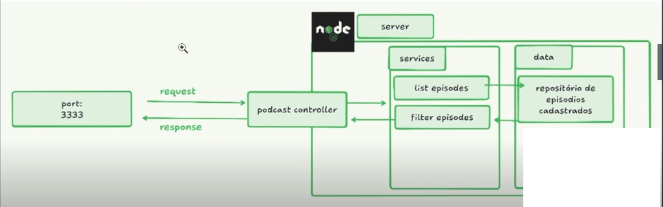

# Gerenciador de Podcast (Node.js + TypeScript)

API simples para listar e filtrar episodios de podcasts.
Projeto didatico com arquitetura em camadas: `routes -> controllers -> services -> repositories`.

## 1. Objetivo do projeto

Este projeto expoe endpoints HTTP para:

- listar todos os episodios cadastrados
- filtrar episodios pelo nome do podcast

Os dados sao lidos de um arquivo local JSON (`src/repositories/podcastes.json`).

## 2. Tecnologias usadas

- Node.js
- TypeScript
- `tsx` (execucao em desenvolvimento)
- `tsup` (build para `dist/`)

## 3. Arquitetura

Imagem de referencia:



Fluxo da requisicao:

1. `src/server.ts` sobe o servidor HTTP
2. `src/app.ts` recebe request e faz roteamento
3. `src/routes/routes.ts` define as rotas
4. `src/controllers/podcasts_controllers.ts` organiza entrada/saida HTTP
5. `src/services/*.ts` aplica regras de negocio
6. `src/repositories/podcast_repository.ts` acessa o JSON local

## 4. Pre-requisitos

- Node.js 18+ (recomendado Node.js 20+)
- npm

## 5. Como executar (passo a passo)

### 5.1 Instalar dependencias

```bash
npm install
```

### 5.2 Criar arquivo `.env`

Crie um arquivo `.env` na raiz:

```env
PORT=3636
```

### 5.3 Rodar em desenvolvimento

```bash
npm run start:dev
```

Ou com watch:

```bash
npm run start:watch
```

Quando subir, o console mostrara:

```txt
Servidor iniciado na porta 3636.
```

## 6. Endpoints

Base URL local:

```txt
http://localhost:3636
```

### 6.1 Listar episodios

- Metodo: `GET`
- Rota: `/api/list`

Exemplo:

```bash
curl http://localhost:3636/api/list
```

Resposta (exemplo):

```json
[
  {
    "podcastName": "flow",
    "videoId": "pQSuQmUfS30",
    "episode": "CBUM - Flow #319",
    "category": ["fitness", "saude"]
  }
]
```

### 6.2 Filtrar por podcast

- Metodo: `GET`
- Rota: `/api/podcasts?p=flow`
- Query param `p`: nome do podcast

Exemplo:

```bash
curl "http://localhost:3636/api/podcasts?p=flow"
```

## 7. Codigos de status usados

- `200 OK`: quando encontrou resultados
- `204 No Content`: quando nao encontrou resultados

## 8. Scripts npm

- `npm run start:dev`: sobe servidor com `tsx`
- `npm run start:watch`: sobe servidor com reload automatico
- `npm run dist`: gera build em `dist/`

## 9. Estrutura de pastas

```txt
.
|-- docs/
|-- src/
|   |-- controllers/
|   |-- models/
|   |-- repositories/
|   |-- routes/
|   |-- services/
|   |-- utils/
|   |-- app.ts
|   `-- server.ts
|-- package.json
`-- tsconfig.json
```

## 10. Troubleshooting rapido

### Erro de TypeScript: `Cannot find name 'Promises'`

Use `Promise` (singular) no tipo de retorno.

Exemplo correto:

```ts
Promise<PodcastTransferModel>
```

### Porta indefinida no console

Se aparecer `Servidor iniciado na porta undefined`, confira se existe `.env` com `PORT=...`.

## 11. Melhorias futuras (opcional)

- validar query params
- tratar erros com `try/catch` nos services/repository
- padronizar nome de campos (`category` vs `categories` no JSON)
- adicionar testes automatizados
